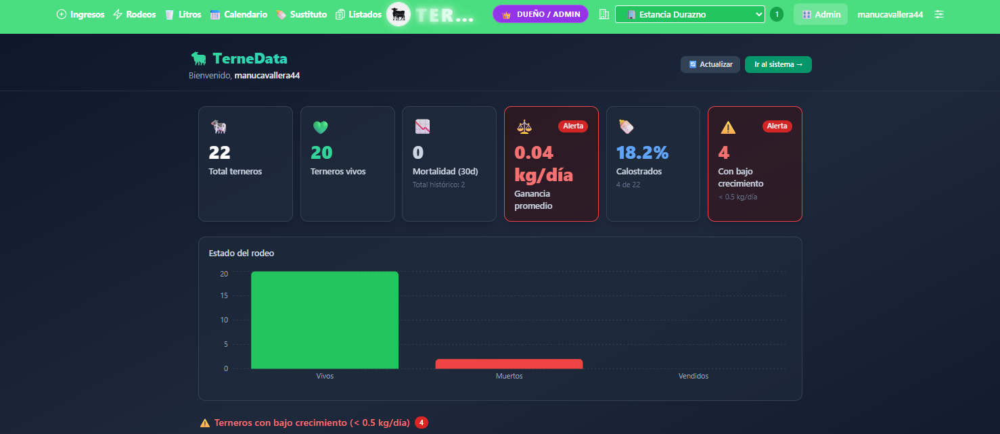
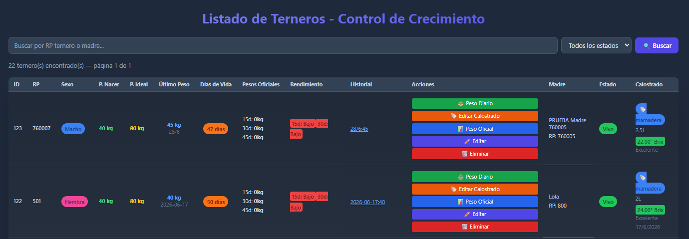
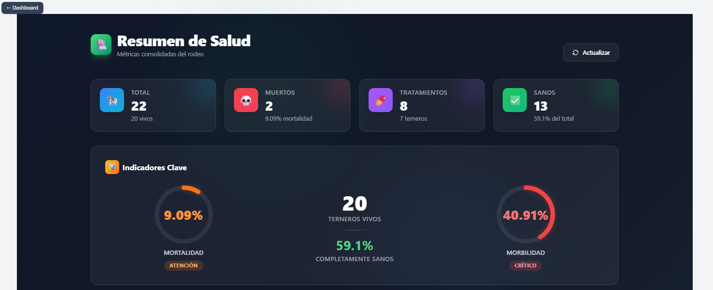
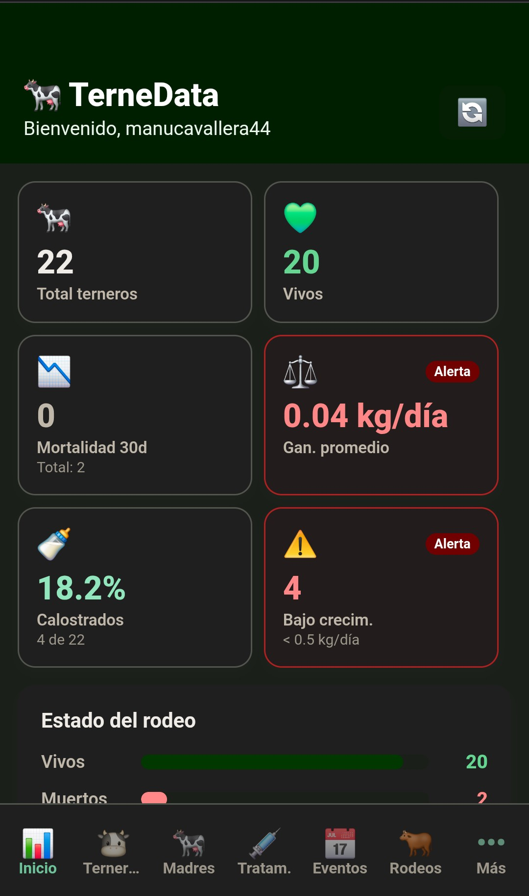

# 🐄 TerneData — Plataforma AgTech para Gestión Ganadera

> ⚠️ **Nota:** El código fuente de este proyecto es privado por tratarse de un producto comercial bajo licencia. Este repositorio funciona como un *case study* para demostrar la arquitectura, el diseño de la solución y las tecnologías implementadas.

## 📖 Resumen del proyecto

TerneData es una plataforma AgTech multiplataforma para digitalizar la gestión diaria de establecimientos ganaderos. Centraliza la trazabilidad de madres y terneros, el seguimiento sanitario, los tratamientos, los rodeos y los indicadores productivos en una experiencia accesible desde escritorio y dispositivos móviles.

La plataforma permite a productores y equipos de trabajo organizar la información del campo, reducir registros manuales y tomar decisiones basadas en datos actualizados.

## 🚀 Funcionalidades principales

- **Trazabilidad de animales:** registro y seguimiento de madres y terneros, incluyendo estado, peso, nacimiento, movimientos y observaciones.
- **Gestión sanitaria:** tratamientos, episodios de diarrea, controles de salud y alertas de bajo crecimiento.
- **Rodeos y establecimientos:** organización de animales por rodeo y administración de uno o varios establecimientos.
- **Producción y planificación:** registro de litros de leche, calendario de eventos y calculadora de sustituto lácteo.
- **Dashboard de indicadores:** cantidad de animales, mortalidad, ganancia diaria de peso, alertas sanitarias y estado del rodeo.
- **Gestión de equipo:** usuarios, roles, invitaciones y permisos para productores, operarios y colaboradores.
- **Autenticación segura:** registro, login, verificación de email, recuperación de contraseña y control de acceso mediante JWT.
- **Experiencia multiplataforma:** aplicación web y aplicación mobile construida con React Native y Expo.

## 🛠️ Arquitectura y stack tecnológico

TerneData está compuesto por servicios independientes de autenticación y lógica de negocio, consumidos por clientes web y mobile.

- **Web:** Next.js, React y Tailwind CSS.
- **Mobile:** Expo, React Native y React Navigation.
- **Backend:** NestJS, dividido en servicios de seguridad/autenticación y lógica de negocio.
- **Base de datos:** PostgreSQL con TypeORM.
- **Autenticación:** JWT, verificación de email, recuperación de contraseña, roles y permisos.
- **Infraestructura:** Docker, Nginx y despliegue en EasyPanel.
- **Lenguajes:** JavaScript en frontend y TypeScript en los servicios backend.

## 📸 Interfaz y demostración

Las siguientes capturas utilizan datos de prueba.

### Dashboard principal

Vista general de indicadores productivos, estado del rodeo, alertas sanitarias y métricas de crecimiento.

### Módulo de trazabilidad

Interfaz para registrar y consultar información individual de madres y terneros.

### Gestión sanitaria

Registro de tratamientos, controles sanitarios y seguimiento de episodios de salud.

### Aplicación mobile

Acceso móvil a las principales funciones de gestión del establecimiento.

## 🎯 Problema que resuelve

La administración ganadera suele depender de cuadernos, planillas dispersas y comunicación informal entre los integrantes del campo. Esto dificulta mantener una trazabilidad confiable, identificar problemas sanitarios a tiempo y conocer el estado productivo real del establecimiento.

TerneData concentra esa información en una única plataforma, permitiendo consultar y registrar datos desde cualquier dispositivo.

## 🔐 Seguridad

La plataforma incluye:

- Autenticación mediante JWT.
- Verificación de email.
- Recuperación y actualización de contraseña.
- Gestión de roles y permisos.
- Control de acceso por establecimiento.
- Invitaciones para incorporar colaboradores al equipo.

## 📱 Plataformas

- Aplicación web para administración completa.
- Aplicación mobile para registrar y consultar información desde el campo.
- Backend API preparado para integrar nuevos clientes o servicios en el futuro.
